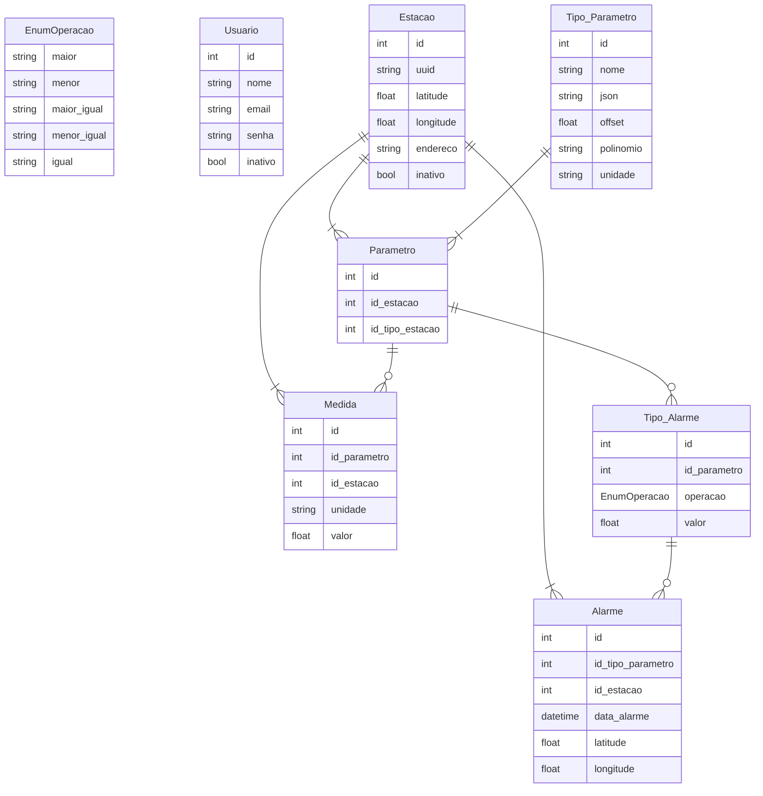

```mermaid
erDiagram
    EnumOperacao {
        string maior
        string menor
        string maior_igual
        string menor_igual
        string igual
    }

    Usuario {
        int id
        string nome
        string email
        string senha
        bool inativo
    }

    Estacao ||--|{ Parametro : ""
    Estacao ||--|{ Medida : ""
    Estacao ||--|{ Alarme : ""
    Estacao {
        int id
        string uuid
        float latitude
        float longitude
        string endereco
        bool inativo
    }

    Tipo_Parametro ||--|{ Parametro : ""
    Tipo_Parametro {
        int id 
        string nome
        string json
        float offset
        string polinomio
        string unidade
    }

    Parametro ||--o{ Medida : ""
    Parametro ||--o{ Tipo_Alarme : ""
    Parametro {
        int id
        int id_estacao
        int id_tipo_estacao
    }

    Medida
    Medida {
        int id
        int id_parametro
        int id_estacao
        string unidade
        float valor
    }

    Tipo_Alarme ||--o{ Alarme : ""
    Tipo_Alarme{
        int id
        int id_parametro
        EnumOperacao operacao
        float valor
    }

    Alarme
    Alarme {
        int id
        int id_tipo_parametro
        int id_estacao
        datetime data_alarme
        float latitude
        float longitude
    }
```